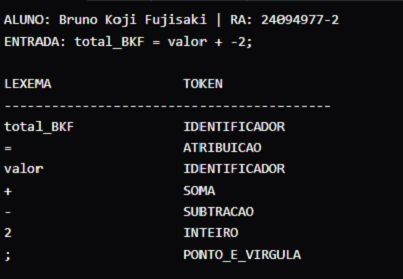
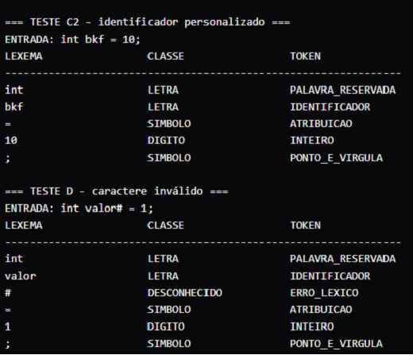
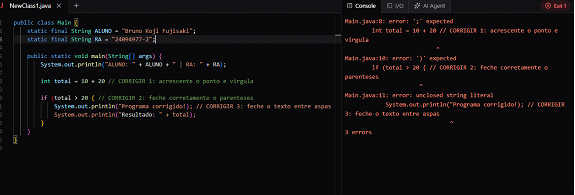
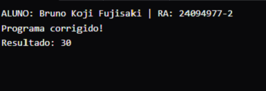
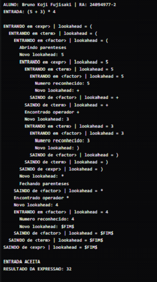
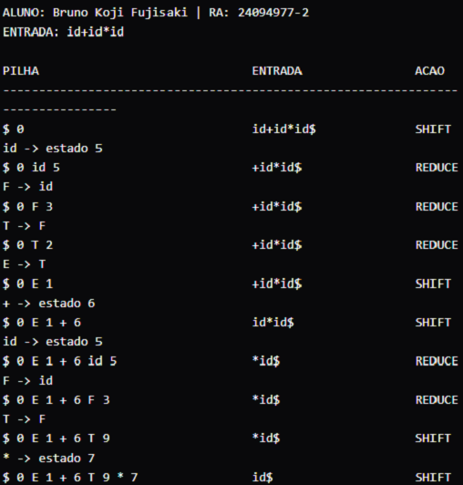

# 🛠️ Roteiro de Aula Exploratória Prática — Capítulo 4

> **Disciplina:** Paradigmas de Linguagens de Programação
>
> **Tema:** Análise Léxica e Análise Sintática em Java
>
> **Referência:** SEBESTA, Robert W. *Conceitos de Linguagens de Programação*. 11. ed. Capítulo 4.

## 📋 Preparação

Nesta atividade prática, o objetivo é **copiar, executar, alterar e registrar** pequenos programas Java para tornar visíveis as etapas internas de um compilador.

> ⚠️ **Regra Principal:** Não pesquise durante a atividade. Siga cada passo na ordem, altere somente o solicitado e observe o comportamento no console.

### Instruções Iniciais:

1. Abra o compilador (ambiente com Java 17+ local ou online).
2. Substitua os campos `ALUNO` e `RA` nos programas antes da primeira execução.
3. Garanta que o código e o console fiquem visíveis ao salvar as imagens de evidência.

---

## 🚉 Estação 1 — De caracteres a lexemas e tokens

### 📌 Conceito & Atividade

Observe como o código-fonte em texto bruto é dividido pelo **analisador léxico** em unidades com significado.

* **Arquivo:** `01-lexemas-tokens/Main.java`
* **O que fazer:** Substitua a constante `ENTRADA` por uma atribuição personalizada (ex: `total_mg = valor + 25;`), execute o programa e observe a classificação dos lexemas em tokens como `IDENTIFICADOR`, `OPERADOR`, `NUMERO_INTEIRO` e `PONTO_E_VIRGULA`.

### 🖼️ Evidência

### 💡 Ponto de Observação

* [x] O texto `total_mg` é o **lexema** (a sequência concreta de caracteres).
* [x] `IDENTIFICADOR` é o **token** (a categoria sintática abstrata).

---

## 🚉 Estação 2 — O que o analisador léxico reconhece

### 📌 Conceito & Atividade

Aprenda a diferenciar como o analisador trata espaços em branco, comentários, palavras reservadas, identificadores e caracteres inválidos.

* **Arquivo:** `02-classes-reservadas/Main.java`
* **O que fazer:** Insira um `IDENTIFICADOR_PERSONALIZADO` (ex: `nota_mg`). Execute o código e compare os testes para notar como comentários e espaços são ignorados, como palavras reservadas (ex: `int`, `while`) diferem de identificadores comuns, e como símbolos não pertencentes ao alfabeto da linguagem (ex: `#`) geram erros léxicos.

### 🖼️ Evidência

### 💡 Ponto de Observação

* [x] Espaços em branco adicionais não criam novos tokens.
* [x] Comentários são descartados pelo analisador léxico.
* [x] `int` é classificado como `PALAVRA_RESERVADA`, enquanto `inteiro` ou `nota_mg` são `IDENTIFICADOR`.
* [x] Caracteres não reconhecidos disparam mensagens de `ERRO_LEXICO`.

---

## 🚉 Estação 3 — Quando o compilador encontra erros

### 📌 Conceito & Atividade

Utilize as mensagens de diagnóstico do compilador para identificar e reparar erros sintáticos e léxicos intencionais.

* **Arquivo:** `03-diagnosticos/Main.java`
* **O que fazer:**
  1. Tente compilar o programa original sem alterações e capture o erro inicial gerado pelo compilador.
  2. Identifique os problemas apontados nas marcações (`CORRIGIR 1`, `CORRIGIR 2`, `CORRIGIR 3`): ponto e vírgula ausente, parêntese não fechado ou string sem delimitação final.
  3. Corrija o código e execute-o novamente até obter sucesso.

### 🖼️ Evidências

#### 1. Erro de Compilação Detectado

#### 2. Programa Corrigido com Sucesso

### 💡 Ponto de Observação

* [x] **Erro Léxico:** Texto entre aspas não finalizado (malformação do token de string).
* [x] **Erro Sintático:** Ponto e vírgula ou parênteses ausentes (violação das regras estruturais da gramática).

---

## 🚉 Estação 4 — Parser descendente recursivo

### 📌 Conceito & Atividade

Acompanhe o funcionamento de um **Parser Descendente Recursivo** percorrendo uma expressão matemática do símbolo inicial até os componentes básicos.

* **Arquivo:** `04-parser-descendente/Main.java`
* **O que fazer:** Substitua a constante `ENTRADA` por uma expressão com parênteses (ex: `(5 + 3) * 4`). Acompanhe no console a pilha de chamadas dos métodos `expr` (expressão), `term` (termo) e `factor` (fator).

### 🖼️ Evidência

### 💡 Ponto de Observação

* [x] O parser inicia da regra mais geral (`expr`) e desce recursivamente chamando `term` e `factor`.
* [x] Operações de maior precedência (como multiplicação ou parênteses) são resolvidas em níveis mais profundos da árvore sintática.
* [x] Recursão à esquerda direta causaria um laço infinito nesse tipo de parser.

---

## 🚉 Estação 5 — Parser ascendente: deslocar e reduzir

### 📌 Conceito & Atividade

Compreenda o funcionamento de um **Parser LR (Ascendente)** observando o processo de empilhamento de tokens e redução por regras gramaticais.

* **Arquivo:** `05-parser-ascendente/Main.java`
* **O que fazer:** Execute a entrada `id+id*id` e observe a evolução das três colunas: `PILHA`, `ENTRADA` e `ACAO`.

### 🖼️ Evidência

### 💡 Ponto de Observação

* [x] **SHIFT (Deslocar):** Transfere o token atual da entrada para a pilha do parser.
* [x] **REDUCE (Reduzir):** Substitui uma sequência de símbolos na pilha pelo não-terminal correspondente, segundo uma regra gramatical.
* [x] **ACCEPT (Aceitar):** Indica que a entrada completa foi reduzida com sucesso ao símbolo inicial.

---